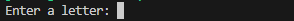
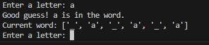
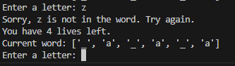
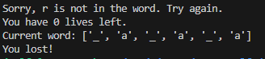
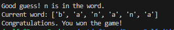

# Hangman

In this project, I have created my version of the [Hangman](<https://en.wikipedia.org/wiki/Hangman_(game)>) game in Python as part of the AiCore Data Analytics pathway content. Hangman is a classic game in which a player thinks of a word and the other player tries to guess that word within a certain amount of attempts.

This is an implementation of the Hangman game, where the computer choses a word randomly from a given list of words and the user tries to guess it. The user must guess the word one letter at a time. If a letter in the word is guessed correctly, it is filled in. Each incorrect guess loses a life, and when the number of lives reaches 0, the player has lost the game. 

The motivation for this project is to demonstrate my understanding of Python based on the learning content and self-learning up to this point in the course. 

In this project, I learned how to break a project down into steps and iteratively combine them into a finished program. I continuously scrutinised my code, ensuring that any repeated code blocks were abstracted. It also reinforced my learning surrounding object-orientated programming, and pushed me to understand how to fix bugs within my code. I also learned the value of documentation, as between days I found myself referring to my comments to understand what sections of my code were resposible for. 

## Requirements

- Fork this repo
- Clone this repo
- Python3

## Usage
The main module in this repo is milestone_5.py. This is where the game is played. 
Once the repo has been cloned, run the following:
   
    python3 milestone_5.py

If you are using another version of python, use the correct command in place of python3. 
In the terminal, you will be prompted to enter a single, alphabetic letter guess. 

Once you have entered your guess and hit enter, you will be told if your guess is in the word or not, and shown the length of the word, the position of your correct guesses, and the number of remaining lives if the guess is incorrect. 

Or: 

The game will end when you run out of lives or you guess the word correctly.

Or:

## File Structure 
This repo contains four files. 

**milestone_2.py**: Within this module two key variables are tested. 
- `hangman_word_list` (list): Defines the list of words the computer can randomly choose from.
- `chosen_word` (str): Using the choice method from the random module, the computer chooses a word from the __hangman_word_list__.

If you want to see the list of words and the chosen word, run the milestone_2 code directly.

**milestone_3.py**: Within this module, I tested how to create a function for the user to input a single letter guess. The milestone_2 module is imported, and the users guess compared with the chosen word. 
- __`check_guess()`__: This function checks if the user input (referred to as guess) is in the computer chosen word.
- __`ask_for_input()`__: This function asks for a user input and stores it in the variable guess. Before assigning the user input to the variable guess (str), it checks if the input is a single, alphabetic character. 

**milestone_4.py**: Within this module, the functions of milestone_2 and milestone_3 are combined into the Hangman class. 
- __`Hangman()`__: This class contains three functions: 
    - __`__init__()`__: This initialises all of the main variables of the class. It takes 2 parameters alongside self:
        - `word_list` (list): This is a list of words that the computer will randomly choose from. 
        - `num_lives` (int): This is the number of lives left to the user. It is initialised to 5 by default. 
    *Other variables that are initialised*:
        - `word` (str): The random.choice method is used to randomly select a word from word_list. 
        - `num_letters` (int): This returns the number of unique letters word.
        - `list_of_guesses` (list): A list of guesses made by the user. Each guess is appended to the end of this list. It is initialised as an empty list.
        - `word_guessed` (list): A list the length of word where each unguessed letter is represented with "_".
    - __`check_guess()`__: This function works the same as the `check_guess()` function from milestone_3. It takes in the parameter guess. It has been updated to convert the guess and word to lower case. The guess is compared to each letter in the word iteratively within an if loop. If the guess is in the word, word_guessed is updated to replace "_" with the guess at the correct index. 
    - __`ask_for_input()`__: This function works the same as the `ask_for_input()` function from milestone_3. It has been updated to also compare the guess to `list_of_guesses`, and if the letter has already been guessed it returns the message "You already tried that letter". If the letter has not been guessed, it is appended to `list_of_guesses`. 

**milestone_5.py**: Within this module, the game is pulled together. The code from milestone_4 is in this module, along with a _`play_game()`_ function.
- __`play_game()`__: This function takes `word_list` as an argument. The variable num_lives is assigned the value of 5. An instance of the Hangman class is created (game), and `word_list` and `num_lives` passed as arguments. Whilst `num_lives` and `num_letters` are > 0, the user is repeatedly asked for input. When either = 0, the game ends. 

At the end of this module, the _`play_game()`_ function is called, and the `word_list` created in milestone_2 is passed to it as an argument to test that the code works. 

## Installation

    $ git https://github.com/jvrolfe/hangman.git

## Liscence

`None`